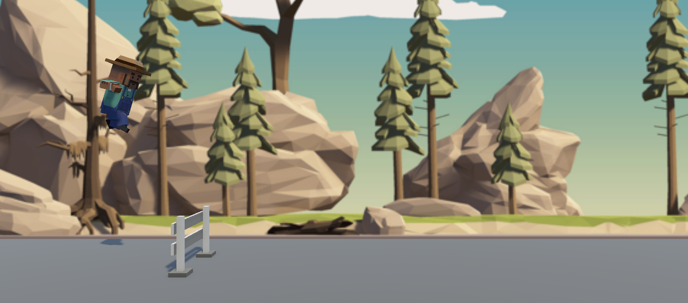

# 🕹️ Prototype 3 – Side-Scrolling Platformer

> Third in my **Create With Code** series, this project brings a classic platformer to life.  
> With jumping mechanics, gravity, animations, obstacles, and layered backgrounds — it’s a full-on Unity side-scroller.

---

<p align="center">
  
  <br><em>From launchpad to leap – a side-scroll snapshot in motion 🚀🧍‍♂️🌳</em>
</p>

---

## 🎮 Game Overview

In **Prototype 3**, players control a 3D character that automatically runs across the screen while the environment scrolls.  
The player must **jump over obstacles**, land safely, and avoid hazards.

🔹 **Auto-run + Jump**  
🔹 **Gravity-based physics**  
🔹 **Obstacle detection & destruction**  
🔹 **Animation control via state machines**

---

## 🧠 Concepts Practiced

| Concept | Implementation |
|--------|----------------|
| Rigidbody Force | Jumping & gravity-based falling |
| Animator Controllers | Switching between idle/jump states |
| Physics Triggers | Obstacle interaction & destruction |
| Vector3 + Input | Jump direction and control |
| Script Components | Clean, modular code structure |

---

## 🛠️ Tech Stack

- **Engine:** Unity 2022.x (3D Core Template)
- **Language:** C#
- **IDE:** Visual Studio Code
- **Version Control:** Git & GitHub

---

## 📁 File Structure (Simplified)

```
Assets/
┣ Scripts/
┃ ┣ PlayerController.cs
┃ ┣ RepeatBackground.cs
┃ ┗ SpawnManager.cs
┣ Animations/
┣ Prefabs/
┣ Scenes/
┣ Art/
┗ Materials/
```


---

## 📸 Screenshot

<p align="center">
  
</p>


---

## 📦 Build Status

| Feature | Status |
|--------|--------|
| Jump Mechanics | ✅ Implemented |
| Infinite Background | ✅ Repeating |
| Obstacle Spawning | ✅ Functional |
| Animator Control | ✅ Linked |
| GitHub Upload | ✅ Done |
| README | ✅ You’re reading it 😎 |

---

## 📜 License

This project is built as part of Unity's **Create with Code** curriculum.  
Feel free to learn from or fork it, but please don’t submit as original coursework.

---

## 👨‍💻 Author

**Anirban Ghosh**  
Unity Indie Dev | Game Design Enthusiast | Code Craftsman  
🌐 [GitHub](https://github.com/AnirbanGhosh2503)

---

> 🧩 This is Prototype 3 of 5 in my Unity learning sprint.  
> I’m building one game a day to level up and go indie — next up: **Prototype 4** (Sumo Knockoff Arena 👊💥)

